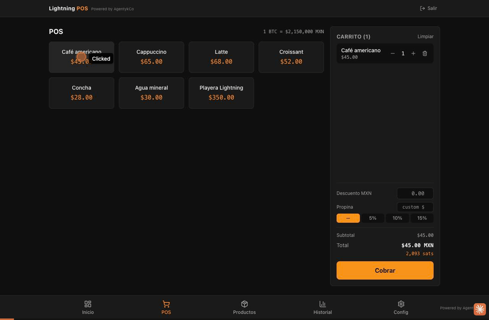
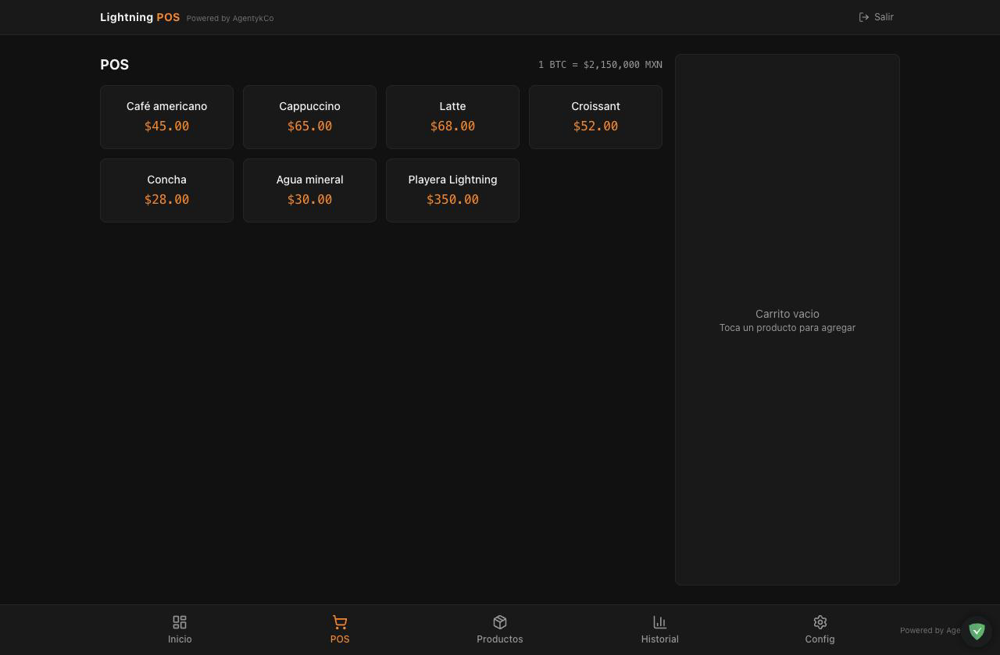
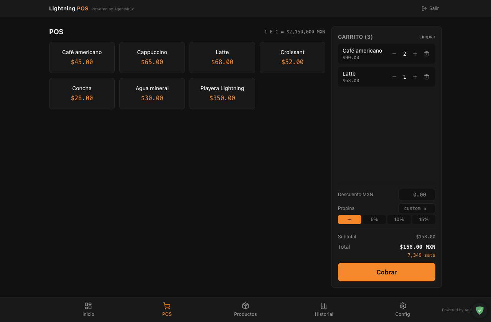
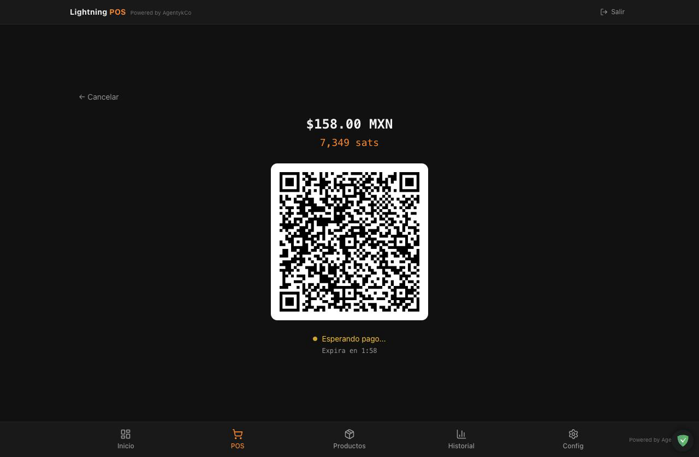
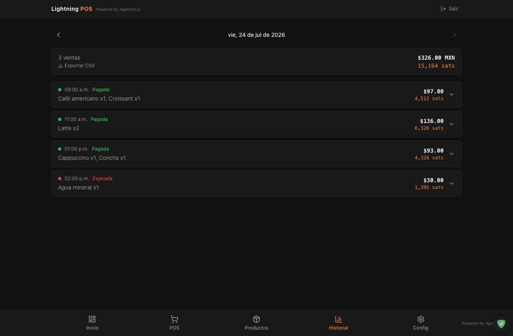
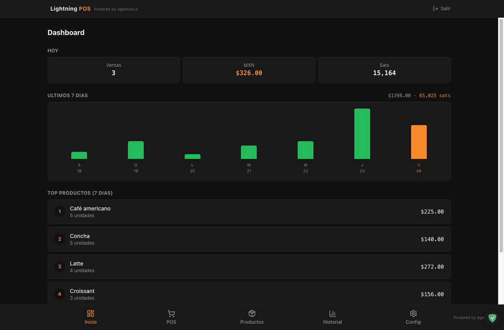
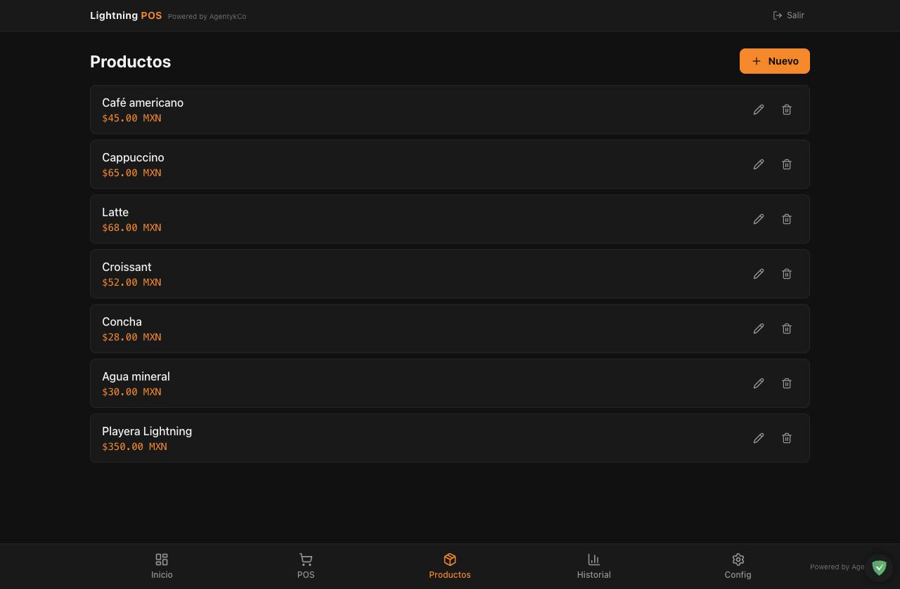

# Lightning POS ⚡

Punto de venta móvil (PWA) para aceptar pagos en Bitcoin por Lightning Network, con precios en MXN y conversión automática a sats.

> **Estado:** en producción — **[pos.lightningnetwork.tf](https://pos.lightningnetwork.tf)**. Probá el producto sin instalar nada ni tocar el backend con el **[modo demostración](https://pos.lightningnetwork.tf/demo)** (o con el PIN `1111`): un PoS mock 100% en el navegador.

## Capturas

Todas las imágenes son del **modo demostración** en vivo ([`/demo`](https://pos.lightningnetwork.tf/demo)), que replica el flujo completo con datos de ejemplo y **sin conexión al backend**.



<table>
  <tr>
    <td width="50%"><b>Catálogo y cobro táctil</b><br></td>
    <td width="50%"><b>Carrito con propina y descuento</b><br></td>
  </tr>
  <tr>
    <td><b>Cobro Lightning: QR BOLT11 · MXN↔sats</b><br></td>
    <td><b>Historial de ventas del día</b><br></td>
  </tr>
  <tr>
    <td><b>Dashboard: hoy, últimos 7 días, top productos</b><br></td>
    <td><b>Gestión de productos (ABM)</b><br></td>
  </tr>
</table>

## Características

- 🛒 Catálogo de productos y carrito, pensado para uso táctil en móvil
- ⚡ Cobro por Lightning: genera invoice BOLT11 con QR vía [LNbits](https://lnbits.com/)
- 💱 Conversión MXN → sats en tiempo real con tipo de cambio de Bitso
- 🔔 Confirmación de pago por webhook + WebSocket, con *poll fallback* si el WS cae
- 🔐 Autenticación por PIN con JWT firmado, rate limit y lockout ante fuerza bruta
- 📊 Dashboard de ventas e historial
- 📱 Instalable como PWA (manifest + service worker)

## Stack

| Capa | Tecnología |
|---|---|
| Backend | Python 3.12 · FastAPI · SQLite (aiosqlite) |
| Frontend | React 19 · Vite · TypeScript · Tailwind CSS v4 |
| Lightning | LNbits (+ Phoenixd como funding source en producción) |
| Infra | Docker Compose · Nginx (frontend) |

Arquitectura limpia en ambos lados: `domain/` (entidades y ports), `application/` (use cases), `infrastructure/` (DB, APIs externas, WebSocket) y `presentation/` (routes / components).

El frontend nunca habla con LNbits directamente: FastAPI actúa como middleware y es el único que conoce las API keys.

## Quickstart (desarrollo)

Requisitos: Docker + Docker Compose.

```bash
cp .env.example .env

# Levanta backend + frontend + LNbits con FakeWallet (sin Bitcoin real)
docker compose -f docker-compose.yml -f docker-compose.dev.yml up -d --build
```

Primer arranque:

1. Abrir LNbits en `http://localhost:5001`, crear cuenta y wallet.
2. Copiar la **Admin key** del wallet y ponerla en `.env` como `LPOS_LNBITS_API_KEY`.
3. Reiniciar el backend: `docker compose -f docker-compose.yml -f docker-compose.dev.yml up -d backend`.
4. Abrir el POS en `http://localhost:8080` y configurar un PIN.

Para simular un pago con FakeWallet: desde otro wallet de la misma instancia LNbits, pegar el BOLT11 en *Pay invoice*. El webhook marca la venta como pagada y la UI lo refleja al instante.

## Tests

Todos los tests corren en Docker; no hace falta instalar pytest ni Playwright localmente.

```bash
# Backend (pytest + httpx): lifecycle de invoices, idempotencia de webhooks,
# concurrencia de catálogo y stress de 5 cajeros simultáneos
docker compose -f docker-compose.test.yml run --rm --build backend-tests

# E2E (Playwright)
docker compose -f docker-compose.test.yml run --rm --build playwright

# Limpieza
docker compose -f docker-compose.test.yml down --volumes --remove-orphans
```

## Configuración

Todas las variables del backend usan el prefijo `LPOS_` y están documentadas en [`.env.example`](.env.example). Las críticas para producción:

- `LPOS_JWT_SECRET` — obligatorio (`openssl rand -hex 32`)
- `LPOS_PIN_HASH` — SHA-256 del PIN inicial
- `LPOS_LNBITS_URL` / `LPOS_LNBITS_API_KEY` / `LPOS_LNBITS_WEBHOOK_SECRET`
- `LPOS_ALLOWED_ORIGINS` — CORS explícito, sin wildcards

## Decisiones de diseño

- Montos en MXN se almacenan como `REAL`; montos en sats como `INTEGER`.
- Nombre y precio del producto se desnormalizan en `sale_items` al momento de la venta: el ticket histórico no cambia si el catálogo se edita después.
- Webhooks de pago son idempotentes; reintento de LNbits no duplica ventas.

## Licencia

[MIT](LICENSE)
